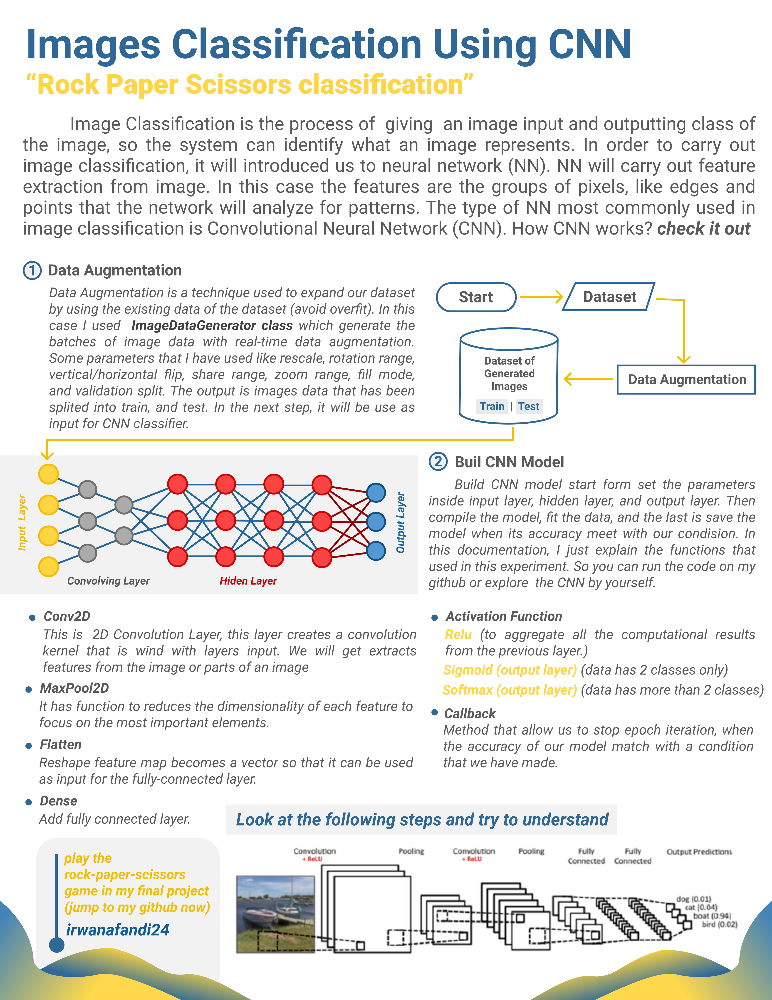

# Dicoding-Basic-ML-and-Tensorflow

This repository contains basic machine learning like supervised learning, unsupervised learning, dimension reduction and tensorflow. You can also find my Dicoding's final project "rock-papper-scissor" detection using CNN + my mini game improvement from this project. There are 3 python files : 

<ul>
  <li>Dicoding Basic ML</li>
  <li>Dicoding Tensorflow</li>
  <li>Final Test Rock Paper Scissors</li>
 </ul>

**How to run the project:**
<ol>
  <li>Install the library (tensorflow and keras)</li>
  <li>Make sure you have load the data from the dicoding link, this link containt rock-paper-scissors data set. You also can download this file if you want to see the contents inside</li>
  <li>Run the code by clik shift+enter</li>
</ol>

<strong>Note</strong>: if you run the game, it's gonna be error. You have to add 3 images in the same directory (rock.png, paper.png and scissors.png) then run the code

**Project Overview:**

